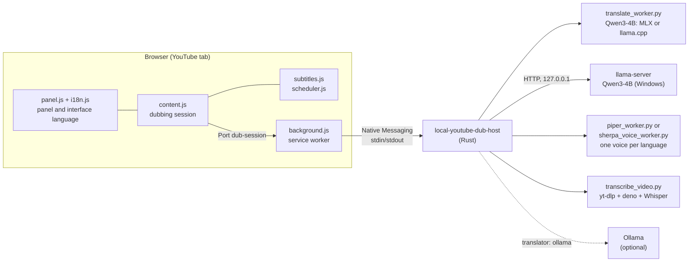
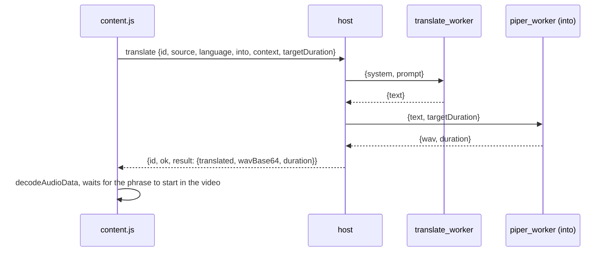
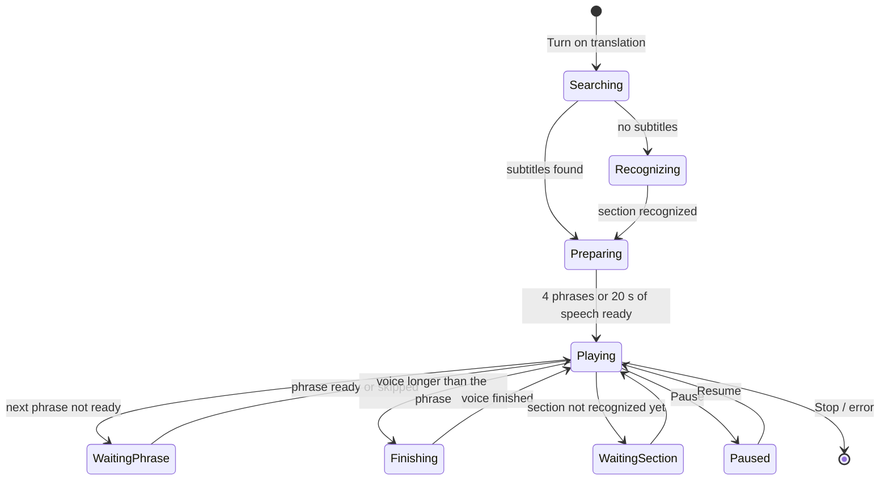

# Architecture

How YouTube Translate is built and why it is built that way. Building, running and testing the project are covered in [DEVELOPMENT.md](DEVELOPMENT.md).

## Components

| Component | Responsible for | Not responsible for |
|---|---|---|
| `extension/i18n.js` | interface text in four languages, picking the language from the browser | what to show |
| `extension/panel.js` | markup, styles, settings, position, rendering messages in the interface language | dubbing logic |
| `extension/content.js` | the session: phrases, the request queue, keeping the voice in sync with the video | text: it passes message keys |
| `extension/subtitles.js` | reading YouTube subtitles, grouping lines into phrases | playback |
| `extension/scheduler.js` | pure decisions: which phrase to prepare and play, when to pause the video, joining chunked answers | side effects |
| `extension/background.js` | bridge between the tab and the local app, the toolbar icon, requests to the YouTube player | message contents |
| `extension/page-hook.js` | keeps the player's subtitle responses, in the page's own world | everything else |
| `src/main.rs` | the protocol, translation and voice queues, environment checks, on-demand recognition, error codes | the models themselves |
| `src/llama_server.rs` | starting `llama-server`, waiting for it, talking to it, restarting it | the prompt |
| `src/process_tree.rs` | a child process and everything it starts, killed as one (process group or Job Object) | what runs in it |
| `worker/*.py` | one model per process, loaded for the whole session | the browser protocol |

Python is there because MLX, llama.cpp's binding, faster-whisper, Piper, sherpa-onnx and yt-dlp are Python libraries. Rust owns the protocol, the queues and isolation: a hung or crashed worker is restarted and the session carries on.

## Platforms

The same models run on every platform; only the engines differ.

| | Apple Silicon | Linux, Intel Mac | Windows (x64, ARM64) |
|---|---|---|---|
| Translation | MLX, `mlx-community/Qwen3-4B-Instruct-2507-4bit` | llama.cpp through llama-cpp-python, `unsloth/Qwen3-4B-Instruct-2507-GGUF` (Q4_K_M) | the same GGUF in `llama-server`, llama.cpp's release build |
| Recognition | MLX Whisper small | faster-whisper small, int8 on the CPU | sherpa-onnx: Whisper small int8 ONNX, Silero VAD |
| Voices | piper-tts | piper-tts | the same Piper voices in sherpa-onnx |
| Audio decoding | ffmpeg | ffmpeg | PyAV |
| Python packages | `requirements-apple-silicon.txt` | `requirements-cpu.txt` | `requirements-windows.txt` |
| Other downloads | — | — | `scripts/fetch.py`: llama-server, Deno, espeak-ng data, Silero VAD |
| Browser registration | `~/Library/Application Support/<browser>/NativeMessagingHosts` | `~/.config/<browser>/NativeMessagingHosts`; snap browsers are not supported (see below) | the registry, `HKCU\Software\<browser>\NativeMessagingHosts` |
| Process tree | process group | process group | Job Object |

**Snap browsers.** A snap browser starts the host inside its sandbox, where `/usr` is the snap's own and the project's Python environment (a venv pointing at the system Python) cannot run. The host recognizes this from `SNAP_NAME` and answers `sandboxed_browser`, and `install-host.sh` no longer registers snap Chromium.

**Threads.** The browser decodes the video on the same CPU, so llama.cpp uses two threads fewer than there are cores (at least two; `DUB_LLAMA_THREADS` overrides). On 4 cores with 2 kept busy, 2 threads prepared a phrase in about 3.5 s and 4 threads in about 5.5 s.

The host picks the engines at build time (`cfg!(target_os, target_arch)`), and `translator`, `asr` and `voice_engine` in `bin/config.json` override them. `setup.sh` and `setup.ps1` install the matching packages and models.

**Memory on Linux.** On ARM, llama.cpp repacks the weights into a CPU-friendly copy by default: 2.8 GB of anonymous memory the kernel cannot reclaim. On a 5 GB machine that got the host OOM-killed, and since the host runs in the browser's systemd scope, systemd stopped the browser too. `translate_worker.py` therefore turns repacking off (`use_extra_bufts = false`), leaving about 0.4 GB anonymous plus the mapped model file, which is reclaimable page cache. Before recognizing speech the extension also asks the host not to warm the translation model up, so Whisper and the translation model never load at the same time.

## Windows

Nothing there is compiled on the user's machine, which rules out the Linux engines: llama-cpp-python only ships source for Windows, and neither it nor faster-whisper (CTranslate2) nor piper-tts has a wheel for Windows on ARM. What does exist for both architectures is llama.cpp's own release build, and sherpa-onnx, which runs Whisper and the same Piper voices on onnxruntime.

**`llama-server` as a sidecar.** The translator thread starts `tools/llama/llama-server` on a free port of 127.0.0.1, waits for `/health`, and posts each phrase to `/v1/chat/completions` (`src/llama_server.rs`). The server is started with one slot, a 2048-token context and no prompt cache in RAM: its defaults (automatic slots, the model's full context, an 8 GB prompt cache) are sized for a server, not for a laptop playing video. It allows requests from any web origin, so it gets a random API key per start, passed in its environment: without one any open web page could use it by guessing the port. A server that died, hung past 40 s or answered garbage is dropped, which kills it, and the next phrase starts another; its log is `cache/llama-server.log`, and the end of it goes into the error.

**Which llama.cpp build.** llama.cpp compiles its Windows ARM64 release for armv8.7-a, which takes int8 matrix multiply and bfloat16 for granted. Snapdragon X and Apple M2 or later have them; Apple M1 under Parallels and the Snapdragon 8cx family don't, and there the server dies loading the model with `0xC000001D`, an illegal instruction. `fetch.py` asks Windows (`IsProcessorFeaturePresent`) and, on such a processor, takes the same llama.cpp release built for armv8.2-a with dot product and fp16, which the project's CI builds with llama.cpp's own settings (`llama-arm64` in `.github/workflows/ci.yml`). The host names the cause when a build doesn't fit the processor anyway.

**Voices in sherpa-onnx.** sherpa-onnx needs metadata inside the ONNX file and a `tokens.txt`, which a Piper voice doesn't ship. `sherpa_voice_worker.py` derives both from the voice's `.onnx.json` on first use, into `cache/sherpa-voices/`, so `bin/config.json` names the same voice files on every platform. Voices trained on espeak phonemes use espeak-ng's data from `voices/espeak-ng-data`. The Ukrainian `ukrainian_tts` is trained on letters: it goes through sherpa's character frontend, which encodes text exactly as Piper does (BOS, a pad after every symbol, EOS), after the text is split into NFD code points, as Piper splits it. Output is peak-normalised as Piper's is. Both engines were compared by recognizing their output back with Whisper: the same words in both.

**Recognition in sherpa-onnx.** Whisper there reads at most 30 s at a time, so Silero VAD first cuts the section into stretches of speech of up to 15 s, and Whisper's own segment timestamps split each stretch into sentences, the size of faster-whisper's segments. With the language on `auto`, Whisper guesses per stretch; the language of most of the speech wins, and the stretches guessed otherwise are decoded again in it. The audio is decoded by PyAV, so there is no ffmpeg to install.

**Process model.** Each worker and the server runs in its own Job Object with `JOB_OBJECT_LIMIT_KILL_ON_JOB_CLOSE` (`src/process_tree.rs`). The job's only handle belongs to the host, so the tree dies with the host however the host ends: Chrome ends a host with `TerminateProcess`, which children never hear about, and a translation server left behind would hold gigabytes until the next reboot. Verified by killing the host that way mid-session and mid-recognition: `llama-server`, the voices and the recognition process were all gone. A child is created suspended, put in its job, and only then resumed, so nothing it starts can escape the job. Children get `CREATE_NO_WINDOW`, so no console window flashes.

Three more things the host does for Windows, each after it broke without it:

- **UTF-8 pipes.** Children get `PYTHONUTF8=1` and `PYTHONIOENCODING=utf-8`: Python writes pipes in the ANSI code page, which has no Cyrillic in most locales.
- **No shared stdin.** The recognition process gets an empty stdin instead of the host's. The host's main thread sits in a synchronous read of the browser's pipe, Windows serialises every operation on that handle, and Python's start-up check of its stdin waited for the browser's next message: recognition hung until a phrase request happened to arrive.
- **Paths.** Python is `.venv\Scripts\python.exe`, `PATH` is split and joined with the platform's separator, and `tools\deno` goes first on it, which is where yt-dlp finds Deno.

**Registration.** On Windows Chromium browsers read native messaging manifests only from the registry: `HKCU\Software\<browser>\NativeMessagingHosts\org.local_youtube_dub.host`, whose default value is the manifest's path. `install-host.ps1` writes the manifest to `bin\` and the value for Chrome, Edge, Brave and Chromium.

**First load.** Windows Defender reads a new program or library in full the first time it is loaded: PyAV's FFmpeg libraries took 118 s to import once and 0.2 s after that, and the first recognition waited for it. `setup.ps1` loads the Python engines, Deno and llama-server once, so that happens during setup.

## Languages

| | Values | Decided by |
|---|---|---|
| Video language (`language`) | `auto`, `en`, `es`, `de` | subtitles: the track's code; recognition: Whisper on the first section |
| Dubbing language (`into`) | `ru`, `uk` | panel setting; follows the interface language by default |
| Interface language (`uiLocale`) | `en`, `es`, `ru`, `uk` | the browser's language, or the globe menu |

The three are independent: a German video can be dubbed into Ukrainian with a Spanish interface.

**Translation prompt.** It is written in English, with the source and target languages passed as parameters. If the answer contains letters of the other target language (`ы э ъ ё` in Ukrainian, `і ї є ґ` in Russian) or Chinese characters, the translation is retried once with a strict instruction. If the retry fails too, the phrase is skipped: a voice for one language must not read text in another.

**Voices.** Each dubbing language has its own Piper voice and its own host process (`voices.ru`, `voices.uk`). The Ukrainian `ukrainian_tts` model is trained on letters rather than espeak phonemes. It silently drops capital letters, digits and Latin script, so the voice workers first turn the text into lower-case Cyrillic and spell numbers out (`num2words`, in `voice_common.py`).

## One phrase end to end

- **Pipeline.** Translation and voicing run on two separate host threads. While phrase N is being voiced, phrase N+1 is already being translated.
- **Two requests in flight.** The extension keeps at most two phrases in flight. That keeps the pipeline busy, and a seek doesn't leave stale phrases piled up in the queue.
- **Context.** Every phrase is sent with two neighbouring lines before and after it. Only the current one is translated.
- **Speech rate.** `targetDuration` is how long the phrase lasts in the video. Piper speeds speech up to fit it (`length_scale` no lower than 0.72, i.e. at most 1.39× faster) without changing the pitch.

## Native Messaging protocol

Each message is JSON preceded by a 4-byte little-endian length. The browser may send up to 1 MB per message; the host sends at most 950,000 bytes.

| Request | Fields | Answer |
|---|---|---|
| `status` | `into`, `warm` | environment check for that dubbing language; unless `warm` is `false`, the host loads the models and answers once they are loaded |
| `translate` | `id`, `source`, `language`, `into`, `contextBefore`, `contextAfter`, `targetDuration` | `{translated, wavBase64, duration}` |
| `transcribe` | `id`, `videoId`, `startSeconds`, `windowSeconds`, `language` | `{language, segments[], windowStart, windowEnd}` |

An answer larger than 950,000 bytes is split into parts:

- audio as `result.wavBase64`, in pieces of 500,000 base64 characters;
- other results as `resultJsonBase64`.

Each part carries `chunkIndex` and `chunkCount`. The extension joins them with `DubScheduler.collectChunk`, which counts the parts received instead of looking for gaps. A sparse array used to hide the gaps, and long phrases were decoded truncated.

### Errors

An error looks like `{id, ok: false, code, params, error}`:

- **`code`** selects the message in `i18n.js` (`error.<code>`);
- **`params`** fill in the message;
- **`error`** is an English detail for the journal. It is also shown when this version of the extension doesn't know the code.

An error without an `id` means the connection is gone, and stops the session. An error with an `id` concerns one phrase, which is skipped.

| Code | Raised by | Effect |
|---|---|---|
| `host_missing`, `host_exited`, `connection_lost` | `background.js`: Chrome can't find the host, the host crashed, the port closed | session stopped |
| `python_missing`, `translator_missing`, `translation_model_missing`, `voice_missing`, `config_invalid`, `ollama_unreachable`, `ollama_model_missing` | the `status` check | session doesn't start |
| `translation_failed`, `voice_failed`, `voice_empty`, `worker_failed`, `worker_timeout` | a single phrase | phrase skipped |
| `ffmpeg_missing`, `js_runtime_missing`, `youtube_blocked`, `download_failed`, `language_unsupported`, `recognition_failed`, `cancelled` | recognition of a section | first section: session doesn't start; later sections: one retry after 10 s, then the section is skipped |
| `bad_request`, `internal` | an invalid request or an internal failure | depends on the request |

The test `every message key and error code used by the code has a text` collects every code in `main.rs`, `transcribe_video.py` and `background.js` and checks that each one has a message.

The host and the Python workers speak JSON lines. A worker first reports `{"ready": true}` or `{"error": ...}`, then answers every request line with one line.

## The session in the extension

Every 80 ms `tick` asks the scheduler (`scheduler.js`) what to do at the current point of the video. The scheduler is made of pure functions, each with tests.

**Sync rules:**

- **Ducking.** While the voice speaks, the original is turned down to the level set in the panel. If the next phrase starts within 1.5 s, the volume stays down; otherwise it would jump on every sentence.
- **Long voice.** The video first slows to 0.9× (pitch preserved). If that's not enough, it pauses at the phrase boundary.
- **Phrase not ready.** The video waits for it. After 45 s without an answer the phrase is skipped.
- **Seeking.** The phrase being spoken is cut off, and the queue is rebuilt from the new position.
- **Ads.** An ad plays in the same `<video>` from 0:00, so the extension steps aside while it runs.
- **Translation paused.** The voice stops, the original plays at full volume, and phrases keep being prepared.
- **Stop and races.** A start-attempt counter cancels a `start()` that resumes after an `await` once Stop has been pressed. Audio decoded after a stop is discarded.
- **Manual volume and speed.** Changes made in the YouTube player are remembered. The extension tells its own changes apart by the value it expects.

## Panel position

The panel is pinned to the window edge it is closer to: by its bottom edge in the lower half, by its top edge in the upper half. An opened section grows away from that edge and never pushes the header out of the window.

The panel is never taller than the window; anything beyond that scrolls inside the sections. A `ResizeObserver` refits the panel into the window on every size change. The position is stored as `{right, top}` or `{right, bottom}`.

## Localization

- **Keys, not text.** `content.js` never builds text. It passes the panel messages of the form `{key, params, fallback}`, and params can be messages themselves: for example, the reason inside a skipped-phrase warning.
- **Re-rendering.** The panel keeps what is on screen as keys: the status, the warning, the metrics. Switching the language from the globe menu re-renders everything at once, without restarting the session.
- **Language names.** Wherever a language is offered as a choice, it is named in that language: English, Español, Deutsch, Русский, Українська. People can find their own language even in an interface they can't read.
- **Manifest.** The extension's description and toolbar tooltip are translated through Chrome's standard `_locales`. Those follow the browser's language rather than the panel's choice, because Chrome shows them outside the page.

## Where the text comes from

1. **A YouTube subtitle track.** The list of tracks comes from the player's data (`captionTracks`), the text in `json3` format with exact start times and durations.
   - **Choosing a track.** Manual subtitles win over automatic ones, and among automatic ones the track of the original audio wins. A video YouTube dubs itself has a recognized track for every dub, and only the original's matches what the speaker says.
   - **Loading through the player.** YouTube only answers a subtitle request that carries the `pot` proof-of-origin token. The player adds it and the extension cannot: a direct request for `baseUrl` returns `200` with an empty body. So `page-hook.js` keeps the player's subtitle responses from the very start of the page load. If the track isn't there yet, the background page asks the player to load it through the player's API (`setOption("captions", "track", …)`), takes the text, and puts the player's subtitle choice back as it was. The direct request remains as a fallback.
   - **Ads.** While an ad plays the player belongs to it and requests the ad's subtitles, so the extension waits for the ad to end.
   - **The page's main world.** The player's data and API are only reachable there, so they are accessed through `chrome.scripting` with `world: "MAIN"`.
2. **The transcript panel on the page.** Used if no track could be loaded.
3. **Speech recognition.** Used when there are no suitable subtitles at all: no English, Spanish or German track, or no track could be loaded.
   - the host downloads the audio track (`yt-dlp`);
   - cuts a 180 s section (`ffmpeg`; PyAV on Windows);
   - recognizes it with Whisper small: MLX Whisper on Apple Silicon, sherpa-onnx on Windows, faster-whisper elsewhere.

   To get the audio URL, yt-dlp has to run YouTube's JavaScript, and for that it needs Deno. On macOS and Linux Deno is installed into `.venv` with the Python packages, on Windows into `tools\deno` from its release, and the host puts that folder first on `PATH`. Without Deno YouTube answers `403 Forbidden`.

Lines without letters ("♪", "…") and labels such as `[Music]`, `[Musik]`, `[Оплески]` are never voiced.

## Data on disk

Everything lives inside the project folder:

| Path | What | Size | Cleanup |
|---|---|---|---|
| `.venv/` | Python environment (with Deno on macOS and Linux) | ~1.6 GB | `make setup` recreates it |
| `tools/` | Windows: `llama/` (llama-server), `deno/` | ~0.1 GB | `setup.ps1` recreates it |
| `cache/huggingface/` | translation and recognition models | ~2.6 GB (Windows ~2.9 GB) | manual |
| `voices/` | Piper voices; on Windows also `espeak-ng-data/` | 60–80 MB per voice | manual |
| `cache/sherpa-voices/`, `cache/models/` | Windows: voices converted for sherpa-onnx, Silero VAD | 60–80 MB per voice | redone when missing |
| `cache/llama-server.log` | the last llama-server's log | small | overwritten on every start |
| `cache/<id>.m4a`, `.webm` | downloaded audio of a video | ~1 MB per minute | oldest removed beyond `DUB_AUDIO_CACHE_MB` (1024) |
| `cache/<id>.asr-<start>-<window>-<lang>.json` | transcript of a section | a few KB | kept |
| `bin/config.json` | host settings | — | `make install` fills in defaults and migrates old keys |

The browser (`chrome.storage.local`) keeps only the panel's settings: languages, volumes, whether text is shown, position, whether the panel is collapsed.

## Trust boundaries

- **Who can talk to the host.** Only the extension with the fixed ID, as listed in `allowed_origins` of the Native Messaging manifest. The ID is derived from the public key in `manifest.json`; the private key is kept outside the repository.
- **Which pages can talk to the extension.** The background page only accepts ports from `https://www.youtube.com/` tabs. The extension has no `externally_connectable`.
- **Input validation.** The host checks everything it receives: a video ID is exactly 11 characters of `[A-Za-z0-9_-]`, phrase and context lengths are capped, languages must be in `SOURCES` and `TARGETS`.
- **The Ollama URL** may only point at `127.0.0.1` or `localhost`.
- **Network.** The translation model is loaded with `HF_HUB_OFFLINE=1`, and `llama-server` is started with `--offline`. Only `yt-dlp` (YouTube) and setup (models) go online.
- **Local servers.** `llama-server` listens on 127.0.0.1 only and requires a key generated for each start (see [Windows](#windows)).
- **Downloads on Windows.** `fetch.py` checks every file against a SHA-256 pinned in the script: llama.cpp and Deno releases, espeak-ng data, Silero VAD, the models at pinned revisions, the default voices. The project's own builds (the host, llama-server for older ARM processors) are checked against the SHA-256 GitHub records for the release asset, which proves the file is the one the workflow uploaded, not who ran the workflow.

## Reliability

- **Hung worker.** A watchdog on every Python worker call: 120 s to load a model, 40 s to answer. A hung worker is killed together with its process tree, the phrase gets `worker_timeout`, and the next phrase starts the worker again. Cancelling recognition also kills the tree, yt-dlp and ffmpeg included. `llama-server` has the same limits, through its HTTP timeouts.
- **Warm-up before the clock starts.** The answer to `status` waits until the translation model and the voice are loaded. The extension starts each phrase's 45 s clock when it sends the phrase, and on a slow machine a model still loading used to make the first phrases miss it.
- **Lost answer.** A 45 s timer in the extension: a phrase without an answer is skipped and its slot in the queue is freed.
- **Environment check.** `status` checks Python, the translation model and the voice for the chosen language, and reports whether `ffmpeg` and Deno are present.
- **PATH.** The browser starts the host with a bare `PATH`. The host puts `.venv/bin` (Windows: `.venv\Scripts` and `tools\deno`) first and, on macOS and Linux, adds `/opt/homebrew/bin` and `/usr/local/bin`.
