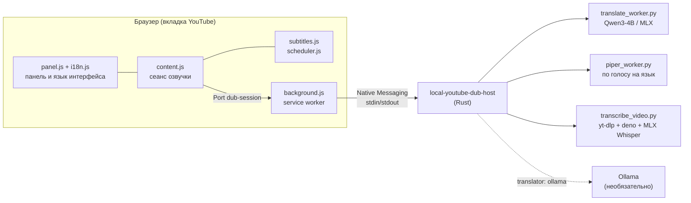
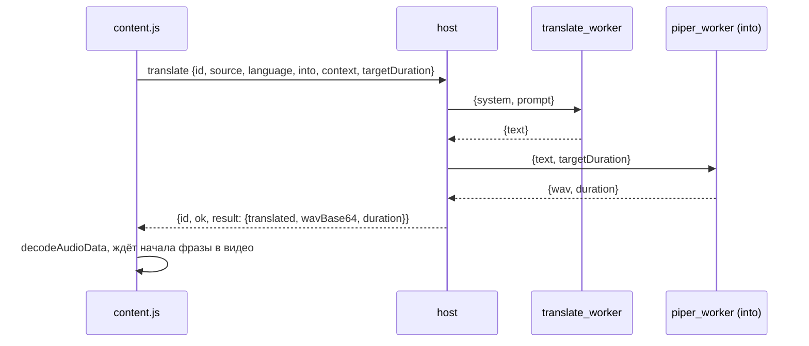
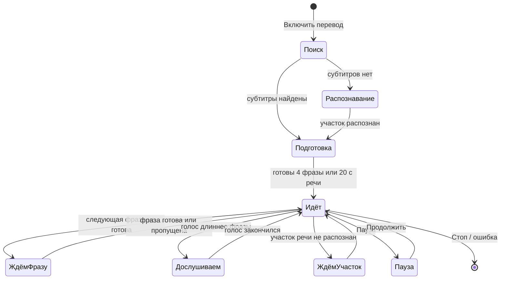

# Архитектура

Документ описывает, как устроен YouTube Translate и почему он устроен именно так. Как собрать, запустить и проверить проект, написано в [DEVELOPMENT.md](DEVELOPMENT.md).

## Компоненты

| Компонент | Отвечает за | Не отвечает за |
|---|---|---|
| `extension/i18n.js` | тексты интерфейса на четырёх языках, выбор языка по браузеру | что показывать |
| `extension/panel.js` | разметку, стили, настройки, положение, отрисовку сообщений на языке интерфейса | логику озвучки |
| `extension/content.js` | сеанс: фразы, очередь запросов, синхронизацию голоса с видео | тексты: передаёт ключи сообщений |
| `extension/subtitles.js` | чтение субтитров YouTube, группировку строк в фразы | воспроизведение |
| `extension/scheduler.js` | чистые решения: какую фразу готовить и играть, когда ставить видео на паузу, сборку ответов из частей | побочные эффекты |
| `extension/background.js` | мост между вкладкой и локальным приложением, значок на панели браузера, запросы к плееру YouTube | содержимое сообщений |
| `extension/page-hook.js` | в мире страницы запоминает ответы плеера на запросы субтитров | всё остальное |
| `src/main.rs` | протокол, очереди перевода и озвучки, проверку окружения, распознавание по запросу, коды ошибок | сами модели |
| `worker/*.py` | по одной модели на процесс, загружена весь сеанс | протокол браузера |

Python нужен потому, что MLX, Piper и yt-dlp существуют только там. Rust держит протокол, очереди и изоляцию: зависший или упавший модуль перезапускается, а сеанс продолжается.

## Языки

| | Значения | Где решается |
|---|---|---|
| Язык видео (`language`) | `auto`, `en`, `es`, `de` | субтитры: код дорожки; распознавание: Whisper на первом участке |
| Язык озвучки (`into`) | `ru`, `uk` | настройка панели; по умолчанию следует за языком интерфейса |
| Язык интерфейса (`uiLocale`) | `en`, `es`, `ru`, `uk` | язык браузера или выбор в меню с глобусом |

Три оси независимы: можно смотреть немецкий ролик с украинской озвучкой в испанском интерфейсе.

**Промпт перевода.** Он написан по-английски, исходный и целевой языки подставляются параметрами. Если в ответе встречаются буквы другого целевого языка (`ы э ъ ё` в украинском, `і ї є ґ` в русском) или китайские иероглифы, перевод повторяется один раз со строгой инструкцией. Если и повтор не помог, фраза пропускается: голос одного языка не должен читать текст на другом.

**Голоса.** У каждого языка озвучки свой голос Piper, свой процесс хоста (`voices.ru`, `voices.uk`). Украинская модель `ukrainian_tts` обучена на буквах, а не на фонемах espeak. Заглавные буквы, цифры и латиницу она просто пропускает, поэтому `piper_worker.py` сначала приводит текст к строчной кириллице и прописывает числа словами (`num2words`).

## Поток одной фразы

- **Конвейер.** Перевод и озвучка идут в двух разных потоках хоста. Пока фраза N озвучивается, фраза N+1 уже переводится.
- **Два запроса в работе.** Расширение держит не больше двух фраз одновременно. Этого хватает, чтобы загрузить конвейер, а при перемотке в очереди не копятся устаревшие фразы.
- **Контекст.** С каждой фразой уходят две соседние реплики до и после. Переводится только текущая.
- **Темп речи.** `targetDuration` — длительность фразы в видео. Piper ускоряет речь (`length_scale` не ниже 0,72, то есть не более чем в 1,39 раза) так, чтобы уложиться в неё, не меняя высоту голоса.

## Протокол Native Messaging

Каждое сообщение — это JSON, перед которым стоят 4 байта длины (little-endian). Из браузера в хост пишется до 1 МБ за сообщение, из хоста в браузер хост отправляет не больше 950 000 байт.

| Запрос | Поля | Ответ |
|---|---|---|
| `status` | `into` | проверка окружения для этого языка озвучки; при успехе хост заранее загружает модели |
| `translate` | `id`, `source`, `language`, `into`, `contextBefore`, `contextAfter`, `targetDuration` | `{translated, wavBase64, duration}` |
| `transcribe` | `id`, `videoId`, `startSeconds`, `windowSeconds`, `language` | `{language, segments[], windowStart, windowEnd}` |

Ответ больше 950 000 байт режется на части:

- звук — `result.wavBase64`, кусками по 500 000 символов base64;
- прочие результаты — `resultJsonBase64`.

У каждой части есть `chunkIndex` и `chunkCount`. Расширение склеивает части через `DubScheduler.collectChunk`: оно считает полученные части, а не ищет пропуски. Разреженный массив прятал пропуски, и длинные фразы декодировались обрезанными.

### Ошибки

Ошибка выглядит как `{id, ok: false, code, params, error}`:

- **`code`** выбирает сообщение в `i18n.js` (`error.<code>`);
- **`params`** подставляются в текст сообщения;
- **`error`** — английская подробность для журнала. Она же показывается, если код этой версии расширения незнаком.

Ошибка без `id` означает, что соединение потеряно, и останавливает сеанс. Ошибка с `id` касается одной фразы, и эта фраза пропускается.

| Код | Где возникает | Последствие |
|---|---|---|
| `host_missing`, `host_exited`, `connection_lost` | `background.js`: Chrome не нашёл хост, хост упал, порт закрылся | сеанс остановлен |
| `python_missing`, `translation_model_missing`, `voice_missing`, `config_invalid`, `ollama_unreachable`, `ollama_model_missing` | проверка `status` | сеанс не начинается |
| `translation_failed`, `voice_failed`, `voice_empty`, `worker_failed`, `worker_timeout` | одна фраза | фраза пропущена |
| `ffmpeg_missing`, `js_runtime_missing`, `youtube_blocked`, `download_failed`, `language_unsupported`, `recognition_failed`, `cancelled` | распознавание участка | первый участок: сеанс не начинается; следующий участок: одна повторная попытка через 10 с, затем участок пропускается |
| `bad_request`, `internal` | неверный запрос или внутренний сбой | зависит от запроса |

Тест `every message key and error code used by the code has a text` находит все коды в `main.rs`, `transcribe_video.py` и `background.js` и проверяет, что для каждого есть текст.

Между хостом и Python-модулями идёт JSON по строкам. Модуль сначала сообщает `{"ready": true}` или `{"error": ...}`, потом отвечает на каждую строку запроса одной строкой.

## Сеанс в расширении

Каждые 80 мс `tick` спрашивает планировщик (`scheduler.js`), что делать в текущий момент видео. Планировщик — это чистые функции, у каждой есть тесты.

**Правила синхронизации:**

- **Приглушение.** На время речи оригинал приглушается до уровня из настроек. Если следующая фраза начинается меньше чем через 1,5 с, громкость не возвращается, иначе она прыгала бы на каждом предложении.
- **Длинный голос.** Видео сначала замедляется до 0,9× (без изменения тона). Если и этого мало, видео ставится на паузу на границе фразы.
- **Фраза не готова.** Видео ждёт её. Если через 45 с ответа нет, фраза пропускается.
- **Перемотка.** Звучащая фраза прерывается, очередь перестраивается от нового места.
- **Реклама.** Реклама играет в том же `<video>` с 0:00, поэтому на это время расширение отходит в сторону.
- **Пауза перевода.** Голос замолкает, оригинал звучит на полной громкости, фразы продолжают готовиться.
- **Стоп и гонки.** Счётчик попыток запуска гасит `start()`, который продолжился после `await`, когда уже нажали «Стоп». Звук, декодированный после остановки, отбрасывается.
- **Ручная громкость и скорость.** Изменения, сделанные в плеере YouTube, запоминаются. Свои собственные изменения расширение отличает от них по ожидаемому значению.

## Положение панели

Панель привязана к тому краю окна, к которому она ближе: в нижней половине — нижним краем, в верхней — верхним. Раскрытый раздел растёт от этого края и не выталкивает заголовок за пределы окна.

Высота панели не больше высоты окна, лишнее прокручивается внутри раздела. `ResizeObserver` заново вписывает панель в окно при любом изменении размера. Положение хранится как `{right, top}` или `{right, bottom}`.

## Локализация

- **Ключи вместо текстов.** `content.js` не собирает текст сам. Он передаёт в панель сообщения вида `{key, params, fallback}`, а параметры могут сами быть сообщениями: например, причина пропуска внутри предупреждения о пропуске.
- **Перерисовка.** Панель хранит то, что сейчас на экране, в виде ключей: статус, предупреждение, показатели. При смене языка из меню с глобусом всё перерисовывается сразу, без перезапуска сеанса.
- **Названия языков.** Везде, где язык предлагается на выбор, он назван на самом себе: English, Español, Deutsch, Русский, Українська. Так человек найдёт свой язык, даже если интерфейс ему незнаком.
- **Манифест.** Описание расширения и подпись значка переведены через стандартные `_locales` Chrome. Эти тексты следуют за языком браузера, а не за выбором в панели: Chrome показывает их вне страницы.

## Источники текста

1. **Дорожка субтитров YouTube.** Список дорожек берётся из данных плеера (`captionTracks`), текст — в формате `json3` с точными началом и длительностью.
   - **Выбор дорожки.** Ручные субтитры предпочтительнее автоматических, а среди автоматических выбирается дорожка исходной звуковой дорожки. У ролика с автодубляжем YouTube своё распознавание есть у каждого дубляжа, и только исходное совпадает с тем, что говорит автор.
   - **Загрузка через плеер.** YouTube отвечает на запрос субтитров, только если в нём есть токен происхождения `pot`. Его добавляет плеер, а расширение добавить не может: прямой запрос по `baseUrl` возвращает `200` с пустым телом. Поэтому `page-hook.js` с самого начала загрузки страницы запоминает ответы плеера на запросы субтитров. Если нужной дорожки там ещё нет, фоновая страница через API плеера (`setOption("captions", "track", …)`) просит его загрузить её, забирает текст и возвращает выбор субтитров в прежнее состояние. Прямой запрос остаётся запасным вариантом.
   - **Реклама.** Пока идёт реклама, плеер принадлежит ей и запрашивает её субтитры, поэтому расширение ждёт конца рекламы.
   - **Основной мир страницы.** Данные и API плеера доступны только там, поэтому к ним обращаются через `chrome.scripting` в `world: "MAIN"`.
2. **Панель расшифровки на странице.** Используется, если дорожка не загрузилась.
3. **Распознавание речи.** Работает, если подходящих субтитров нет. Такое бывает, когда YouTube ошибся с исходным языком: у английского ролика `WADUe-zUE4U` автоматическая дорожка помечена как арабская.
   - хост скачивает звуковую дорожку (`yt-dlp`);
   - вырезает участок в 180 с (`ffmpeg`);
   - распознаёт его через MLX Whisper small.

   Чтобы получить ссылку на звук, yt-dlp выполняет JavaScript YouTube, и для этого ему нужен Deno. Deno ставится в `.venv` вместе с Python-пакетами, а хост ставит `.venv/bin` первым в `PATH`. Без Deno YouTube отвечает `403 Forbidden`.

Строки без букв («♪», «…») и метки вроде `[Music]`, `[Musik]`, `[Оплески]` в озвучку не попадают.

## Данные на диске

Всё хранится внутри папки проекта:

| Путь | Что | Размер | Очистка |
|---|---|---|---|
| `.venv/` | Python-окружение с Deno | ~1,6 ГБ | `make setup` пересоздаёт |
| `cache/huggingface/` | модели перевода и распознавания | ~2,6 ГБ | вручную |
| `voices/` | голоса Piper | 60–80 МБ на голос | вручную |
| `cache/<id>.m4a`, `.webm` | скачанная дорожка ролика | ~1 МБ на минуту | старые удаляются сверх `DUB_AUDIO_CACHE_MB` (1024) |
| `cache/<id>.asr-<start>-<window>-<lang>.json` | расшифровка участка | единицы КБ | не удаляются |
| `bin/config.json` | настройки хоста | — | `make install` дополняет и переносит старые ключи |

В браузере (`chrome.storage.local`) хранятся только настройки панели: языки, громкость, показ текста, положение, свёрнута ли панель.

## Границы доверия

- **Кто может подключиться к хосту.** Только расширение с фиксированным ID: так записано в `allowed_origins` манифеста Native Messaging. ID выводится из открытого ключа в `manifest.json`, а закрытый ключ хранится вне репозитория.
- **Какие страницы могут общаться с расширением.** Фоновая страница принимает порты только от вкладок `https://www.youtube.com/`. У расширения нет `externally_connectable`.
- **Проверка входных данных.** Хост проверяет всё, что приходит: ID ролика — ровно 11 символов `[A-Za-z0-9_-]`, длина фразы и контекста ограничена, языки берутся только из списков `SOURCES` и `TARGETS`.
- **Адрес Ollama** может указывать только на `127.0.0.1` или `localhost`.
- **Сеть.** Модель перевода загружается с `HF_HUB_OFFLINE=1`. В сеть ходят только `yt-dlp` (YouTube) и `make setup` (модели).

## Надёжность

- **Зависший модуль.** Сторожевой таймер на каждый вызов Python-модуля: 120 с на загрузку модели, 40 с на ответ. Зависший модуль убивается вместе с группой процессов, фраза получает `worker_timeout`, следующая фраза запускает модуль заново. Отмена распознавания тоже убивает группу, вместе с yt-dlp и ffmpeg.
- **Потерянный ответ.** Таймер в расширении на 45 с: фраза без ответа пропускается, место в очереди освобождается.
- **Проверка окружения.** `status` проверяет Python, модель перевода и голос нужного языка, а также сообщает о наличии `ffmpeg` и Deno.
- **PATH.** Браузер запускает хост с урезанным `PATH`. Хост ставит впереди `.venv/bin` и добавляет `/opt/homebrew/bin` и `/usr/local/bin`.
